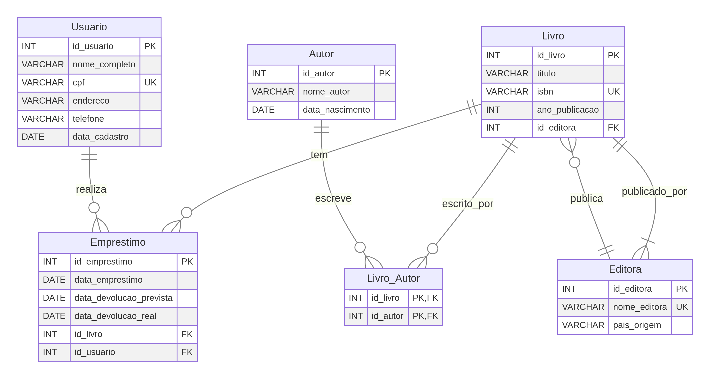

# Diagrama ER de Sistema de Biblioteca: PK, UNIQUE e FK em Ação

Este diagrama Entidade-Relacionamento (ER) ilustra um sistema básico de biblioteca, destacando a aplicação prática de Chaves Primárias (PK), Chaves Estrangeiras (FK) e restrições UNIQUE.



## Explicação das Chaves no Diagrama:

### Chaves Primárias (PK - Primary Key):

As Chaves Primárias são os identificadores únicos e não nulos de cada registro em uma tabela. Elas garantem que cada linha seja única e acessível de forma eficiente.

*   **`id_livro` (Tabela Livro)**: Cada livro na biblioteca terá um `id_livro` exclusivo. É o identificador principal do livro.
*   **`id_autor` (Tabela Autor)**: Cada autor será identificado por um `id_autor` único.
*   **`id_usuario` (Tabela Usuario)**: Cada usuário da biblioteca terá um `id_usuario` exclusivo.
*   **`id_emprestimo` (Tabela Emprestimo)**: Cada empréstimo realizado terá um `id_emprestimo` único.
*   **`id_editora` (Tabela Editora)**: Cada editora será identificada por um `id_editora` único.
*   **`id_livro`, `id_autor` (Tabela Livro_Autor)**: Esta é uma **chave primária composta**. A combinação do `id_livro` e `id_autor` é única, pois um livro pode ter vários autores e um autor pode escrever vários livros. A combinação dos dois identifica a relação específica de autoria.

### Restrições UNIQUE:

As restrições UNIQUE garantem que todos os valores em uma coluna (ou grupo de colunas) sejam diferentes, mas, ao contrário da PK, permitem valores nulos (geralmente apenas um valor nulo, dependendo do SGBD). Elas são usadas para identificar atributos que devem ser únicos, mas não são o identificador principal da entidade.

*   **`isbn` (Tabela Livro)**: O ISBN (International Standard Book Number) é um código único para cada edição de um livro. Embora `id_livro` seja a PK, o `isbn` também deve ser único para evitar duplicidade de registros de livros.
*   **`cpf` (Tabela Usuario)**: O CPF é um documento de identificação único para cada pessoa. Embora `id_usuario` seja a PK, o `cpf` também deve ser único para garantir que não haja dois usuários com o mesmo CPF.
*   **`nome_editora` (Tabela Editora)**: O nome da editora deve ser único para evitar confusão entre diferentes editoras.

### Chaves Estrangeiras (FK - Foreign Key):

As Chaves Estrangeiras são colunas que estabelecem um vínculo entre duas tabelas, referenciando a Chave Primária (ou uma restrição UNIQUE) de outra tabela. Elas são essenciais para manter a integridade referencial e modelar os relacionamentos entre as entidades.

*   **`id_editora` (Tabela Livro)**: Esta FK referencia o `id_editora` da tabela `Editora`. Isso significa que cada livro deve ser publicado por uma editora que exista na tabela `Editora`.
*   **`id_livro` (Tabela Emprestimo)**: Esta FK referencia o `id_livro` da tabela `Livro`. Garante que apenas livros existentes possam ser emprestados.
*   **`id_usuario` (Tabela Emprestimo)**: Esta FK referencia o `id_usuario` da tabela `Usuario`. Garante que apenas usuários cadastrados possam realizar empréstimos.
*   **`id_livro` (Tabela Livro_Autor)**: Esta FK referencia o `id_livro` da tabela `Livro`.
*   **`id_autor` (Tabela Livro_Autor)**: Esta FK referencia o `id_autor` da tabela `Autor`.

Este diagrama demonstra como a combinação dessas chaves permite construir um modelo de dados robusto e consistente para um sistema de biblioteca, garantindo a integridade e a correta representação dos relacionamentos entre as informações.

# GENERATED ALWAYS AS IDENTITY

`GENERATED ALWAYS AS IDENTITY` é a forma **padrão SQL (ISO/ANSI)** de declarar uma coluna cujo valor é gerado automaticamente pelo banco, normalmente para chaves substitutas (`id`). Em PostgreSQL, por exemplo, `id bigint GENERATED ALWAYS AS IDENTITY` cria uma coluna de identidade apoiada por uma sequência implícita. ([PostgreSQL][1])

O ponto central do `ALWAYS` é este: **o banco sempre gera o valor**. Em Db2, uma coluna definida como `GENERATED ALWAYS` não aceita valor explícito no `INSERT`; já em PostgreSQL, inserir valor explícito nessa coluna gera erro, a menos que você use cláusulas próprias como `OVERRIDING SYSTEM VALUE`. ([IBM][2])

A comparação importante é com:

```sql
GENERATED BY DEFAULT AS IDENTITY
```

Nesse caso, o banco gera o valor **só quando você não fornece um**. Se você passar um valor explicitamente, ele pode ser aceito. Essa distinção entre `ALWAYS` e `BY DEFAULT` aparece tanto na documentação do PostgreSQL quanto na do Db2. ([PostgreSQL][1])

Exemplo simples:

```sql
CREATE TABLE cliente (
    id BIGINT GENERATED ALWAYS AS IDENTITY,
    nome VARCHAR(100) NOT NULL
);
```

Aqui, ao fazer `INSERT INTO cliente (nome) VALUES ('Ana');`, o `id` é gerado pelo SGBD. Se a coluna fosse `GENERATED BY DEFAULT AS IDENTITY`, você ainda poderia, em muitos bancos, fornecer um `id` manualmente. ([PostgreSQL][1])

Sobre o que você viu no “ANSI”: o padrão costuma aparecer numa forma **mais completa**, algo como:

```sql
coluna INTEGER
  GENERATED ALWAYS AS IDENTITY
  (START WITH 1 INCREMENT BY 1 ...)
```

Ou seja, a estrutura “ANSI” normalmente mostra a **gramática geral**: primeiro a escolha entre `ALWAYS` ou `BY DEFAULT`, depois `AS IDENTITY`, e opcionalmente uma lista de parâmetros da sequência, como `START WITH`, `INCREMENT BY`, `MINVALUE`, `MAXVALUE`, `CYCLE`, `CACHE` e afins. Isso aparece claramente em materiais e sintaxes de Db2 e Oracle compatíveis com o padrão. ([DB2 Tutorial][3])

Então a diferença que você percebeu costuma ser esta:

* **ANSI/ISO** mostra a **forma canônica e completa** da cláusula.
* **Cada SGBD** implementa essa ideia com pequenas variações de sintaxe, opções suportadas e comportamento.
* Alguns bancos seguem quase literalmente o padrão, como PostgreSQL e Db2.
* Outros usam sintaxe proprietária. No SQL Server, por exemplo, identidade costuma ser declarada com `IDENTITY(seed, increment)`, não com `GENERATED ... AS IDENTITY`. ([PostgreSQL][1])

Também vale não confundir isso com **generated columns calculadas**, que usam outra ideia parecida no nome, por exemplo:

```sql
altura_pol GENERATED ALWAYS AS (altura_cm / 2.54)
```

Nesse caso não é identidade/autoincremento; é uma coluna derivada de expressão. O PostgreSQL documenta isso separadamente de identity columns. ([PostgreSQL][4])

Resumo prático:

* `GENERATED ALWAYS AS IDENTITY` = autogerado e controlado pelo banco.
* `GENERATED BY DEFAULT AS IDENTITY` = autogerado por padrão, mas pode aceitar valor manual.
* A “estrutura diferente” no ANSI geralmente é só a **gramática completa do padrão**, enquanto o banco que você usa pode mostrar uma versão resumida ou proprietária. ([PostgreSQL][1])
