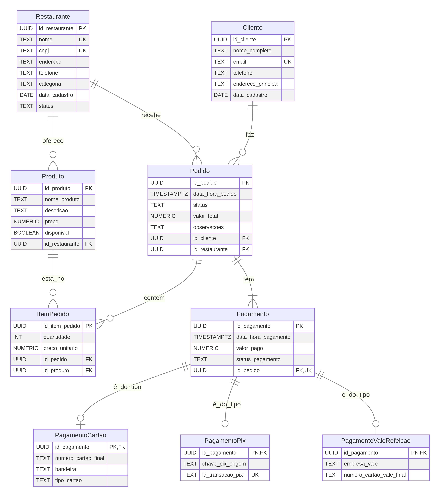

# Solução do Projeto de Banco de Dados - Cenário iFood-like

## 1. Modelo Entidade-Relacionamento (MER)

O diagrama ER abaixo representa as entidades, seus atributos e os relacionamentos para o sistema de delivery de comida, com destaque para a disjunção de pagamentos.

### Descrição das Entidades e Relacionamentos:

*   **Restaurante**: Entidade principal para os estabelecimentos que oferecem produtos.
*   **Cliente**: Entidade para os usuários que realizam pedidos.
*   **Produto**: Entidade para os itens vendidos pelos restaurantes.
*   **Pedido**: Entidade que registra as solicitações dos clientes a um restaurante.
*   **ItemPedido**: Entidade associativa que detalha quais produtos e em que quantidade fazem parte de um pedido.
*   **Pagamento**: Entidade genérica que representa a transação financeira de um pedido.
*   **PagamentoCartao**: Especialização de `Pagamento` para transações via cartão.
*   **PagamentoPix**: Especialização de `Pagamento` para transações via PIX.
*   **PagamentoValeRefeicao**: Especialização de `Pagamento` para transações via vale-refeição.

---

## 2. Modelo Relacional (MR) na 3ª Forma Normal (3FN)

O Modelo Relacional a seguir detalha a estrutura das tabelas, suas chaves primárias (PK), chaves estrangeiras (FK) e restrições UNIQUE, garantindo a conformidade com a Terceira Forma Normal (3FN). A 3FN assegura que todos os atributos não-chave dependem apenas da chave primária e não de outros atributos não-chave, eliminando dependências transitivas.

*   **Restaurante** (`id_restaurante` PK, `nome` UNIQUE, `cnpj` UNIQUE, `endereco`, `telefone`, `categoria`, `data_cadastro`, `status`)
    *   *Justificativa 3FN*: Todos os atributos descrevem diretamente o restaurante e dependem apenas de `id_restaurante`.

*   **Cliente** (`id_cliente` PK, `nome_completo`, `email` UNIQUE, `telefone`, `endereco_principal`, `data_cadastro`)
    *   *Justificativa 3FN*: Todos os atributos descrevem diretamente o cliente e dependem apenas de `id_cliente`.

*   **Produto** (`id_produto` PK, `nome_produto`, `descricao`, `preco`, `disponivel`, `id_restaurante` FK)
    *   *Justificativa 3FN*: `nome_produto` é único apenas dentro do contexto de um `id_restaurante`. `preco` e `disponivel` dependem diretamente do `id_produto`. `id_restaurante` é uma FK para a tabela `Restaurante`.

*   **Pedido** (`id_pedido` PK, `data_hora_pedido`, `status`, `valor_total`, `observacoes`, `id_cliente` FK, `id_restaurante` FK)
    *   *Justificativa 3FN*: `valor_total` é calculado e `status` descreve o pedido. `id_cliente` e `id_restaurante` são FKs para as respectivas tabelas.

*   **ItemPedido** (`id_item_pedido` PK, `quantidade`, `preco_unitario`, `id_pedido` FK, `id_produto` FK)
    *   *Justificativa 3FN*: `quantidade` e `preco_unitario` (do produto no momento do pedido) dependem diretamente do `id_item_pedido`. `id_pedido` e `id_produto` são FKs.

*   **Pagamento** (`id_pagamento` PK, `data_hora_pagamento`, `valor_pago`, `status_pagamento`, `id_pedido` FK UNIQUE)
    *   *Justificativa 3FN*: `id_pedido` é UNIQUE porque um pedido tem apenas um pagamento. `valor_pago`, `data_hora_pagamento` e `status_pagamento` dependem diretamente de `id_pagamento`.

*   **PagamentoCartao** (`id_pagamento` PK FK, `numero_cartao_final`, `bandeira`, `tipo_cartao`)
    *   *Justificativa 3FN*: `id_pagamento` é PK e FK, e os atributos adicionais descrevem o pagamento por cartão.

*   **PagamentoPix** (`id_pagamento` PK FK, `chave_pix_origem`, `id_transacao_pix` UNIQUE)
    *   *Justificativa 3FN*: `id_pagamento` é PK e FK, e os atributos adicionais descrevem o pagamento por PIX. `id_transacao_pix` é UNIQUE.

*   **PagamentoValeRefeicao** (`id_pagamento` PK FK, `empresa_vale`, `numero_cartao_vale_final`)
    *   *Justificativa 3FN*: `id_pagamento` é PK e FK, e os atributos adicionais descrevem o pagamento por vale-refeição.
